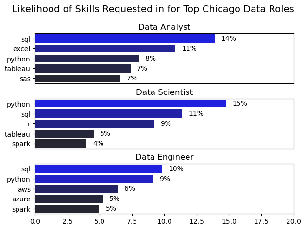
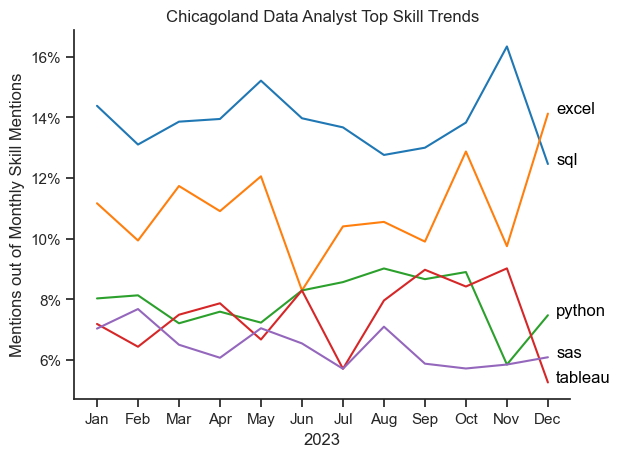
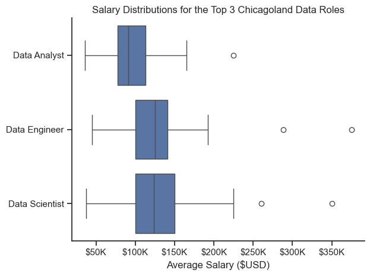
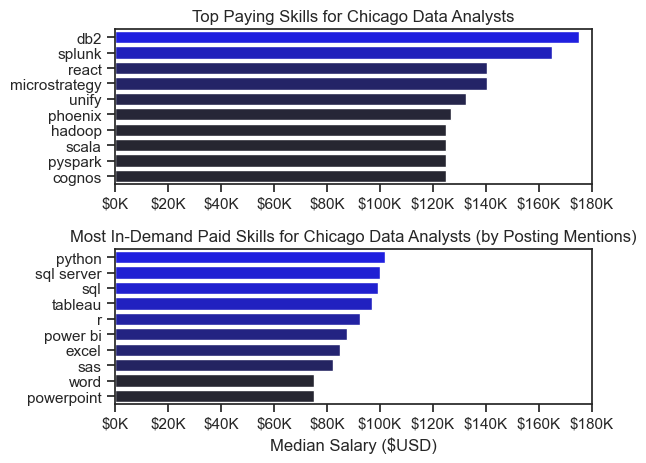
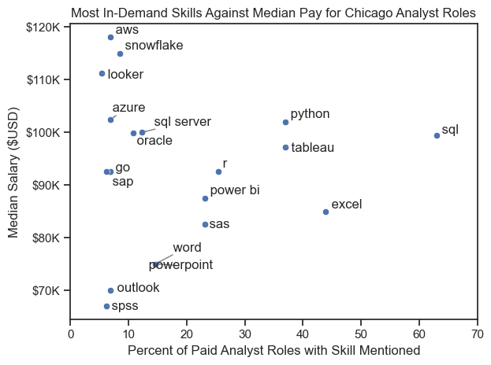

# ▶️ Introduction 

As part of [Luke Barousse's Python for Data Analytics Course](https://www.lukebarousse.com/python), I have been tasked with performing an analysis of webscraped job posting information from 2023 using Python. This dataset compiles thousands of data roles posted on popular job boards like LinkedIn, and offers ample opportunities for budding analysts like myself to practice Python data manipulation and visualization workflows.

The dataset is accessible from this link: https://huggingface.co/datasets/lukebarousse/data_jobs

Sample fields from the dataset include:

* Job Post Date
* Job Post Location
* Company Name
* Job Title
* Salary Information
* Desired Skills
* And more!

⚙️ **TOOLS USED**:

* **Python:** Programming language used to write the project data analyses 
* **Jupyter Notebooks:** The code in the repository is stored in a Jupyter Notebook, which is easy to read because code is separated into relevant sections.
* **Github:** Hosts the publicly accessible repository for this project and enabled version control during production.

# 🏙️ Defining the Analysis

To tailor the analysis project to my interests, I have decided to analyze all Chicagoland area jobs referenced in the dataset. Though I recently accepted a full-time analyst role, I would like to know what skills are sought by employers as I plan future upskilling sessions. 

The code snippets included below handle initial library and dataset imports.

```python
# Library and module imports
import pandas as pd
import matplotlib.pyplot as plt
from matplotlib.ticker import PercentFormatter
import numpy as np
import openpyxl as xl
from datetime import datetime
import ast
from adjustText import adjust_text
from datasets import load_dataset
import seaborn as sns
```

```python
# load in Luke Barousse's jobs dataset as dataframe
dataset = load_dataset('lukebarousse/data_jobs')
jobs_data = dataset['train'].to_pandas()

# Convert job_posted_date to datetime type, convert nested job skill list strings to lists, and output field info
jobs_data['job_posted_date'] = pd.to_datetime(jobs_data['job_posted_date'])
jobs_data['job_skills'] = jobs_data['job_skills'].apply(lambda x: ast.literal_eval(x) if pd.notna(x) else x)
jobs_data.info()
```

# ❔ Analysis Questions

Looking at the Chicagoland job market, my analysis questions are as follows: 

1. What are the Top 3 Data Roles posted within the Chicagoland area? For the Top 3 Data Roles, which companies routinely hire for these roles, and which skills are most frequently mentioned in job posts for the Top 3 Data Roles? 
2. For the Top Role, how do top skills for this role trend over a year of job posts? 
3. How robust is the salary information for Chicagoland jobs in the dataset, and what trends can be extrapolated from it? 
4. Finally, for top role postings with salary information, which skills are most requested and which are most lucrative? Are there skills which balance high demand with good pay? 


# 🚖 Filtering for Chicago "Windy City" Data

The following code snippet isolates job posts within the U.S. that contain the string (any case) 'Chicago' in the job location field:

```python
# Creates chicago-based roles dataframe
chicago_roles_data = (
    jobs_data[(jobs_data['job_country'] == 'United States') & 
    (jobs_data['job_location'].str.lower().str.contains('chicago'))]
    )
```

# 📈 Analysis

The analysis of the Chicagoland dataset is split into sections for each question, respectively. The raw code can be referenced in the attached Jupyter Notebook called [data_workbook](data_workbook.ipynb). 

## Part 1: Assessing Top Data Roles, Companies, and Skills

After filtering for Chicago-based jobs, the dataset contains 5661 jobs. I want to know which roles, by job title, are most posted. Using some simple exploratory analysis functions, like value_counts(), I was able to identify the Top 3 Roles: Data Analyst (2457 posts), Data Scientist (1054 posts), and Data Engineer (737 posts). 

Isolating for the Top 3 Roles in a new dataframe, I then identified the top 10 hiring organizations for these roles. The results were a mix of banks, construction firms, universities, and 3rd party recruiters. The code snippet for this investigation is accessible below:

```python
# What are the top 10 companies hiring for the top 3 role types?

top_data_roles = ['Data Analyst', 'Data Scientist', 'Data Engineer']

top_chicago_roles = chicago_roles_data[chicago_roles_data['job_title_short'].isin(top_data_roles)].copy()
top_chicago_roles['company_name'].value_counts().head(10)
```
Finally, I visualized the top skills for the top 3 roles in three separate horizontal bar charts. This visual helped me assess which skills cut across the different roles. 

```python
# For the Top 3 Roles in Chicago, what are the top in-demand skills? 
top_chicago_skills = top_chicago_roles.explode('job_skills')

role_skill_counts = top_chicago_skills.groupby(['job_title_short', 'job_skills']).size().reset_index(name = 'count')
role_skill_counts['total_roleskill_mentions'] = role_skill_counts.groupby('job_title_short')['count'].transform('sum')

role_skill_counts['perc_mentions_byrole'] = (role_skill_counts['count'] / role_skill_counts['total_roleskill_mentions']) * 100

fig, ax = plt.subplots(3,1)

for i, value in enumerate(top_data_roles):
    plot_role_skills = role_skill_counts[role_skill_counts['job_title_short'] == value].sort_values('perc_mentions_byrole', ascending= False).head()
    sns.barplot(plot_role_skills, x = 'perc_mentions_byrole', y = 'job_skills', ax = ax[i], hue = 'count', palette= 'dark:blue')
    fig.suptitle('Likelihood of Skills Requested for Top Chicago Data Roles', fontsize=14)
    ax[i].set_xlabel('')
    ax[i].set_ylabel('')
    ax[i].set_title(f'{value}')
    ax[i].get_legend().remove()
    ax[i].set_xlim(0,20)
    for idx, v in enumerate(plot_role_skills['perc_mentions_byrole']):
        ax[i].text(v + 0.5, idx, f'{v:.0f}%', va='center')
    plt.tight_layout(h_pad=.8)
    # Only displays axis ticks for the last subplot
    if i != len(top_data_roles) - 1:
        ax[i].set_xticks([])
```

### Results & Takeaways


*Bar Graphs representing the top 5 skills for the top data roles by post mentions*

It's clear that my analysis should hone in on Data Analyst, Data Scientist, and Data Engineer roles, as they make up the majority of the Chicagoland dataset. Furthermore, it appears that SQL and Python cut across all top data roles and rank highly as demanded skills, so my upskilling should focus on these two skills (I'm off to a good start!). 

## Part 2: Tracking in-demand Data Analyst skills over time

Because I work as a Data Analyst, I want to see how top skills for the role are trending over time in the Chicagoland area. For this investigation, I used a line plot with months on the x-axis; this allowed me to see the prevalence of job post mentions over time.

```python
# Visualize the Top 5 Skill Trends over Months
chicago_skills_plot = chicago_analyst_monthly_skill_percents.iloc[:,0:5]
sns.lineplot(chicago_skills_plot, legend=False, palette='tab10', dashes=False)

sns.set_theme(style='ticks')
sns.despine()

plt.title('Chicagoland Data Analyst Top Skill Trends')
plt.xlabel('2023')
plt.ylabel('Mentions out of Monthly Skill Mentions')
plt.gca().yaxis.set_major_formatter(PercentFormatter(decimals=0))

for i in range(5):
    plt.text(11.2, chicago_skills_plot.iloc[-1, i], chicago_skills_plot.columns[i], color='black')
```

### Results & Takeaways
 

*Line Graph representing the top 5 in-demand Data Analyst skills over time*

Month by month, two skills remain king for Data Analysts looking for work in the Chicagoland area: SQL and Excel. Programming and special technologies are secondary to essential query skills.

## Part 3: Making Sense of Salary Information

A caveat of my analysis is that I am working with a small subset of Luke's webscraped data. As a result, I expect limited salary information at a regional level. That said, I want to make use of this data (with a few grains of salt) to better understand the regional pay differences between data roles.

‼️ NOTE: My initial exploratory analysis of Chicago data roles with salaries showed that approximately 6% of Chicago job postings had salary information. Filtering for the Top 3 Data Roles [Data Analyst, Data Engineer, Data Scientist], that number decreases to ~4.5% of the total dataset. When viewing the results below, please consider this nuance.

While the Chicagoland job post subset does not have tons of salary information, I chose to use boxplots to assess the spread of salaries reported for the Top 3 Roles. 

```python
# Plot the average salary distributions for the Top 3 Chicagoland Data Roles
sns.boxplot(top_chicago_roles_salaries, x='salary_year_avg', y='job_title_short')
sns.set_theme(style='ticks')
sns.despine()

plt.title('Salary Distributions for the Top 3 Chicagoland Data Roles')
plt.ylabel('')
plt.xlabel('Average Salary ($USD)')
ticks_x = plt.FuncFormatter(lambda x, pos: f'${int(x/1000)}K')
plt.gca().xaxis.set_major_formatter(ticks_x)

plt.tight_layout()
plt.show()
```
### Results & Takeaways



*Boxplots representing the top salary distributions for the top Chicago data roles*

As a Data Analyst by trade, I feel secure knowing that, in combination with the role name taking the lead as the most in-demand data role in Chicago, the distribution of salaries for the role type is tighter than it is for Data Engineers and Scientists. Yes, the median salary lags behind Engineers and Scientists, but the compensation is more than adequate, especially in the Midwest where the cost of living is cheaper than the East and West coast. With this in mind, I will elect to hone in on Data Analyst pay analyses more closely in the next section.

## Part 4: Identifying Skills that Balance Demand and Solid Pay

The final part of this analysis is split into two parts: 

1. Identifying the Top Skills by Post Mentions (for salaried jobs)
2. Identifying the Skills which Balance Demand vs. Median Salary (for upskilling optimization)

_130_ Data Analyst job posts in the dataset have salary information. I would have liked more data to work with, but the sample is enough to calculate some skill trends by pay.

I broke up this first part of the analysis into two horizontal bar charts which enable easy comparison between Top Paying Skills (which may not have high demand) vs. Top Demanded Skills.



*Bar Charts for Highest Paid Chicago Data Analyst Skills vs. Highest Demand Chicago Data Analyst Skills*

The results show that niche technologies are compensated well. For me, this doesn't seem like much of a surprise - the more niche a technology is, the more specialized it likely is. What should be noted, however, is that these technologies had very small post mentions, with often just one to three jobs mentioning these skills.

On the flip side, high demand skills for Chicago Data Analysts, which may not break into six figures as often as niche technologies, still net respectable earnings. As I upskill, I am going to put my focus in the high-demand technologies.

The final visual of this analysis, which is a scatter plot of the proportion of post mentions vs. median salary by skill, will help me decide where I should put my efforts.

```python
# Plot the relationship between the top demanded skills and their median pay

sns.scatterplot(chicago_analyst_topdemand_skills, x= 'perc_of_paidjobs', y= 'median', legend=False)
plt.title('Most In-Demand Skills Against Median Pay for Chicago Analyst Roles')
ax = plt.gca()
ax.yaxis.set_major_formatter(plt.FuncFormatter(lambda y, _: f'${int(y/1000)}K'))
ax.set_xlabel('Percent of Paid Analyst Roles with Skill Mentioned')
ax.set_ylabel('Median Salary ($USD)')
ax.set_xlim(0, 70)

texts = []
for i, txt in enumerate(chicago_analyst_topdemand_skills.index):
    texts.append(plt.text(chicago_analyst_topdemand_skills['perc_of_paidjobs'].iloc[i], chicago_analyst_topdemand_skills['median'].iloc[i], " " + txt))

# Adjust text to avoid overlap and add arrows
adjust_text(texts, arrowprops=dict(arrowstyle='->', color='gray'))

plt.tight_layout()
plt.show()
```

### Results & Takeaways



*Scatterplot showing the relationship between proportion of skill post mentions and the skill's median salary*